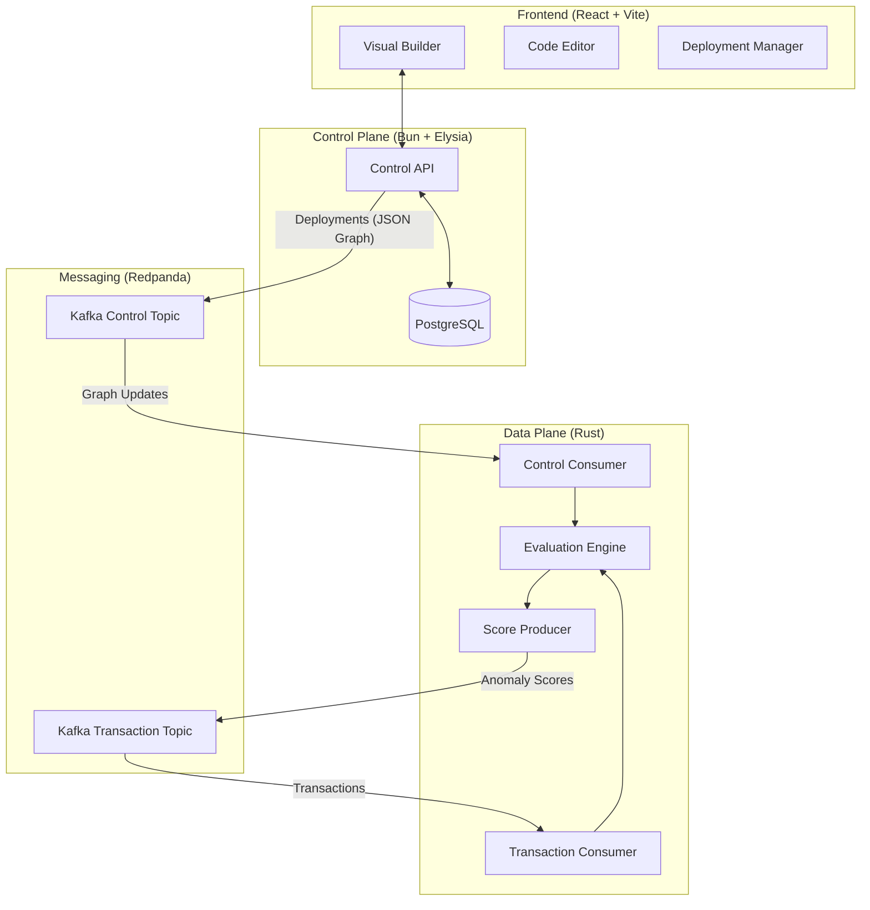
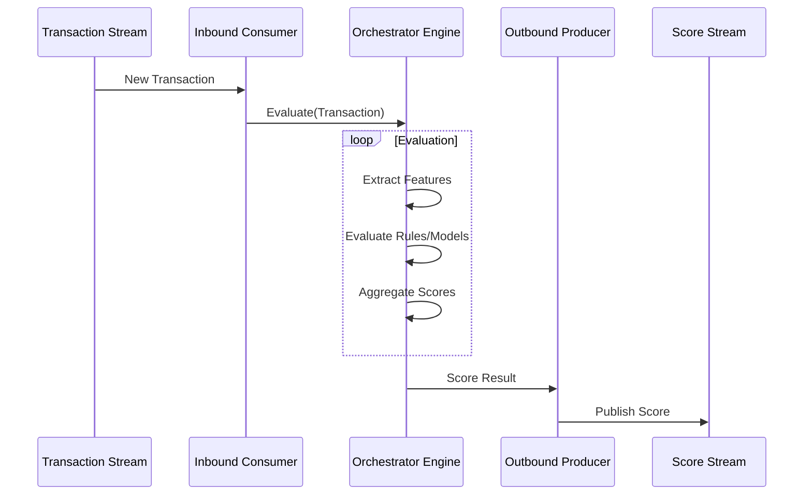

# Architecture: Project Molen

This document provides a deep dive into the technical design and data flow of Project Molen.

## 🏔 Philosophy: The "Molen Wrap"

The core philosophy of Molen is **strict type enforcement across the boundary of control and execution**. We use TypeScript for the high-level orchestration (Control Plane) and Rust for high-performance execution (Data Plane). The "Molen Wrap" ensures that the AST generated in the UI is identical to the AST executed in Rust.

## 🛰 System Components



### 1. Control Plane (`apps/api`)
- **Runtime**: Bun
- **Framework**: ElysiaJS
- **Responsibility**: CRUD operations for fraud-ops entities (Rules, Models, Features) and managing Orchestrator Graphs.
- **Persistence**: PostgreSQL (via Postgres.js).

### 2. Data Plane (`apps/engine`)
- **Language**: Rust
- **Runtime**: Tokio (Async)
- **Responsibility**: Consuming high-volume transaction data and evaluating them against the active Orchestrator Graph.
- **State**: In-memory AST, updated via Kafka events.

### 3. Orchestrator Canvas (`apps/web`)
- **Framework**: React + Vite
- **Graph Engine**: @xyflow/react
- **Responsibility**: Visual editing of the Orchestrator AST with real-time validation (e.g., type checking connections).

## 🔄 Data Flow: Deployment

1.  **UI**: User designs a graph and clicks "Promote".
2.  **API**: Receives the graph, validates it, saves it to Postgres, and publishes the serialized JSON to the `molen_control_dev` Redpanda topic.
3.  **Engine**:
    - The "Control Consumer" loop receives the new graph.
    - It deserializes the JSON into an internal Rust representation.
    - It atomically swaps the active graph in memory.

## ⚡ Data Flow: Execution



1.  **Ingress**: Transactions arrive on `molen_transactions_in`.
2.  **Engine**:
    - The "Transaction Consumer" picks up a message.
    - It iterates through the active Graph's nodes (Extractors -> Rules/Models -> Aggregators).
    - It computes the `Aggregate Anomaly Score`.
3.  **Egress**: The result is published to `molen_scores_out` (planned).

## 📊 Database Schema

The system uses a relational schema to manage the complex relationships between graph versions and components:
- `orchestrators`: Top-level graph containers.
- `orchestrator_versions`: Immutable snapshots of a graph.
- `deployments`: Mapping of versions to environments (Dev/Staging/Prod).
- `feature_extractors`, `rules`, `models`: Reusable building blocks.

## 📡 Event Schema

We use JSON over Kafka for control messages. The schema is defined in `packages/shared-types` and mirrored in Rust structs in `apps/engine/src/main.rs`.

```json
{
  "id": "uuid",
  "name": "Graph Name",
  "nodes": [...],
  "edges": [...]
}
```
